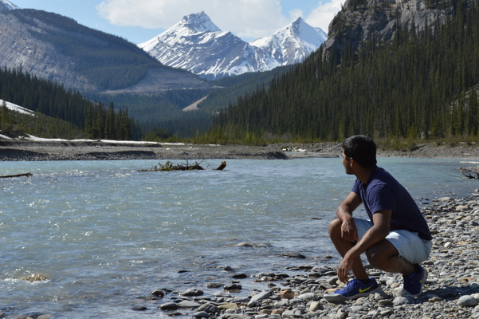
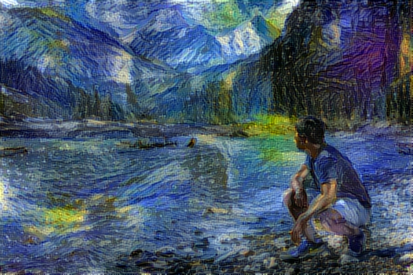
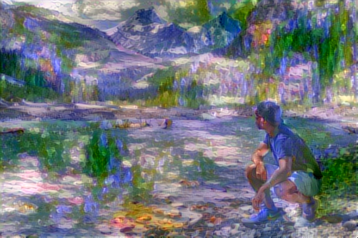
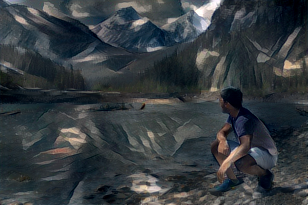
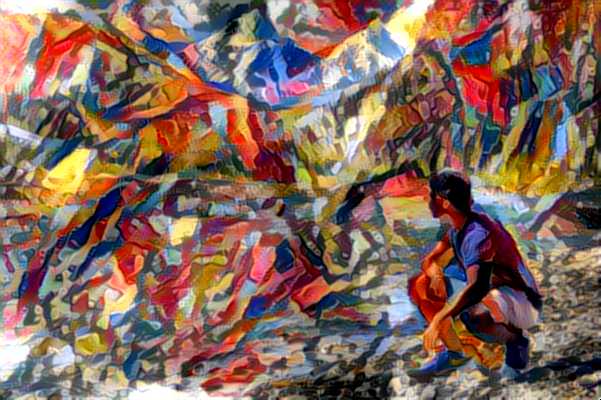

# Neural-Style-Transfer

Inspired by https://arxiv.org/abs/1508.06576 and https://github.com/keras-team/keras/blob/master/examples/neural_style_transfer.py 

Currently extracts style and content of two images, then runs a random noise image on an L-BFGS optimizer to create a new image with the mixed style and content of the two inputs. Saves the image output of each run through of the optimizer and then combines all outputs to form a gif of the training process. 

Example:

Test image:

Style images:

Transformed images:

Transformation Gifs:

